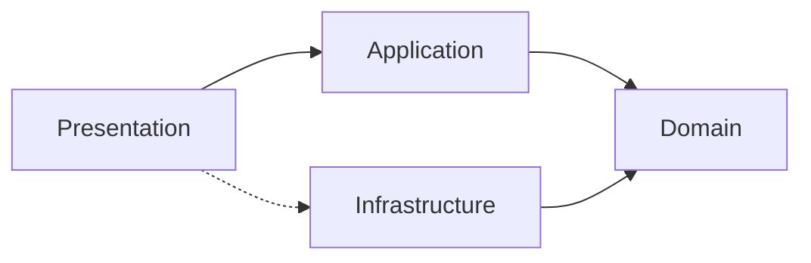
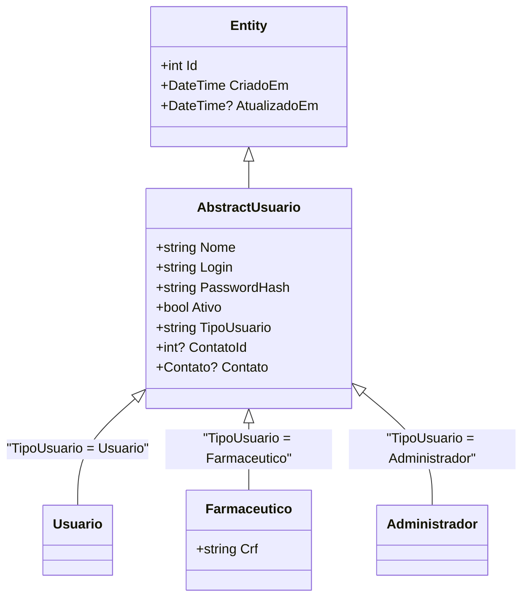
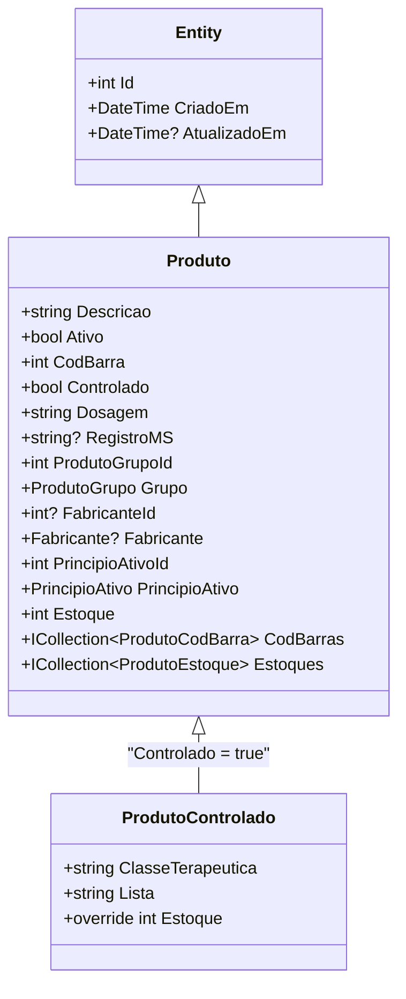

# MiniPDV

Documentação completa da arquitetura, padrões, bibliotecas e uso de cada parte do projeto.

---

## Índice

- [MiniPDV](#minipdv)
  - [Índice](#índice)
  - [1. Visão Geral](#1-visão-geral)
  - [2. Como Rodar](#2-como-rodar)
    - [2.1. Pré-requisitos](#21-pré-requisitos)
    - [2.2. Configuração via `.env`](#22-configuração-via-env)
    - [2.3. Rodar Local (sem containers)](#23-rodar-local-sem-containers)
    - [2.4. Rodar com Podman Compose](#24-rodar-com-podman-compose)
  - [3. Arquitetura — Domain-Driven Design (DDD)](#3-arquitetura--domain-driven-design-ddd)
    - [3.1. Fluxo de Dependência](#31-fluxo-de-dependência)
    - [3.2. Injeção de Dependência](#32-injeção-de-dependência)
  - [4. Camada de Domínio (`Domain/`)](#4-camada-de-domínio-domain)
    - [4.1. Entidades](#41-entidades)
      - [Tabela de Entidades](#tabela-de-entidades)
    - [4.2. Estratégias de Herança (TPH — Table Per Hierarchy)](#42-estratégias-de-herança-tph--table-per-hierarchy)
      - [`AbstractUsuario` → `Usuario`, `Farmaceutico`, `Administrador`](#abstractusuario--usuario-farmaceutico-administrador)
      - [`Produto` → `ProdutoControlado`](#produto--produtocontrolado)
    - [4.3. Enums](#43-enums)
      - [`Conselho` — Conselhos profissionais de saúde](#conselho--conselhos-profissionais-de-saúde)
      - [`UF` — Unidades Federativas do Brasil](#uf--unidades-federativas-do-brasil)
    - [4.4. Interfaces de Repositório](#44-interfaces-de-repositório)
    - [4.5. Validadores de Domínio (`Domain/Rules/`)](#45-validadores-de-domínio-domainrules)
  - [5. Camada de Aplicação (`Application/`)](#5-camada-de-aplicação-application)
    - [5.1. DTOs (`Application/DTOs/`)](#51-dtos-applicationdtos)
    - [5.2. Serviços (`Application/Services/`)](#52-serviços-applicationservices)
      - [Serviços com lógica de negócio complexa](#serviços-com-lógica-de-negócio-complexa)
    - [5.3. Validadores de Aplicação (`Application/Validators/`)](#53-validadores-de-aplicação-applicationvalidators)
  - [6. Camada de Infraestrutura (`Infrastructure/`)](#6-camada-de-infraestrutura-infrastructure)
    - [6.1. Configuração (`Infrastructure/Configuration/`)](#61-configuração-infrastructureconfiguration)
      - [`EnvConfig` — Leitura de variáveis de ambiente](#envconfig--leitura-de-variáveis-de-ambiente)
      - [`AppSettings` — Configurações tipadas](#appsettings--configurações-tipadas)
    - [6.2. Segurança (`Infrastructure/Security/`)](#62-segurança-infrastructuresecurity)
      - [`PasswordHasher`](#passwordhasher)
    - [6.3. Entity Framework Core (`Infrastructure/Data/`)](#63-entity-framework-core-infrastructuredata)
      - [`MiniPDVContext` — DbContext principal](#minipdvcontext--dbcontext-principal)
      - [Entity Mappings (`Infrastructure/Data/Mappings/`)](#entity-mappings-infrastructuredatamappings)
      - [Repositórios (`Infrastructure/Data/Repositories/`)](#repositórios-infrastructuredatarepositories)
    - [6.4. Database Seeding (`Infrastructure/Data/Seed/`)](#64-database-seeding-infrastructuredataseed)
      - [`DatabaseInitializer`](#databaseinitializer)
  - [7. Camada de Apresentação (`Presentation/`)](#7-camada-de-apresentação-presentation)
    - [7.1. API REST](#71-api-rest)
      - [Controladores (`Presentation/API/Controllers/`)](#controladores-presentationapicontrollers)
      - [Exception Middleware (`Presentation/API/Middleware/`)](#exception-middleware-presentationapimiddleware)
    - [7.2. Desktop — Windows Forms](#72-desktop--windows-forms)
      - [`ApiClient` — Singleton HTTP](#apiclient--singleton-http)
      - [Telas (Forms)](#telas-forms)
      - [Componentes Reutilizáveis (`Presentation/Desktop/Components/Controls/`)](#componentes-reutilizáveis-presentationdesktopcomponentscontrols)
  - [8. Autenticação e Autorização](#8-autenticação-e-autorização)
    - [8.1. Políticas de Autorização](#81-políticas-de-autorização)
    - [8.2. Ciclo de Vida do Token JWT](#82-ciclo-de-vida-do-token-jwt)
    - [8.3. Configuração JWT](#83-configuração-jwt)
    - [8.4. Data Protection](#84-data-protection)
  - [9. Configuração de Serialização JSON](#9-configuração-de-serialização-json)
  - [10. Swagger / OpenAPI](#10-swagger--openapi)
    - [Implementação](#implementação)
  - [11. Containerização](#11-containerização)
    - [11.1. `compose.yaml`](#111-composeyaml)
    - [11.2. `Containerfile` (multi-stage)](#112-containerfile-multi-stage)
    - [11.3. `entrypoint.sh`](#113-entrypointsh)
  - [12. Ferramentas Auxiliares](#12-ferramentas-auxiliares)
    - [12.1. Bruno API Client (`Tools/Client/`)](#121-bruno-api-client-toolsclient)
    - [12.2. EF Core Migrations](#122-ef-core-migrations)
    - [12.3. Scripts](#123-scripts)
  - [13. Convenções e Padrões do Código](#13-convenções-e-padrões-do-código)
    - [13.1. Nomenclatura](#131-nomenclatura)
    - [13.2. Padrões](#132-padrões)
    - [13.3. Tratamento de Erros](#133-tratamento-de-erros)
  - [14. Build e Deploy](#14-build-e-deploy)
    - [14.1. Publicação](#141-publicação)
    - [14.2. IIS Deployment](#142-iis-deployment)
    - [14.3. Compilação Condicional](#143-compilação-condicional)
  - [15. Resumo de Pacotes NuGet](#15-resumo-de-pacotes-nuget)

## 1. Visão Geral

**MiniPDV** é um sistema de ponto de venda (PDV) farmacêutico com **dois modos de execução**:

| Modo | Comando | Descrição |
|---|---|---|
| **API** | `dotnet run -- --api` | Servidor REST (ASP.NET Core) na porta `5000` |
| **Desktop** | `dotnet run` | Aplicativo Windows Forms que consome a API (Windows apenas) |

- **Linguagem:** C# / .NET 10 (SDK `10.0.300`)
- **Projeto:** `Microsoft.NET.Sdk.Web`, `OutputType: Exe`
- **ORM:** Entity Framework Core 10 (SQL Server)
- **Validação:** FluentValidation 12.1.1
- **Auth:** JWT Bearer (`Microsoft.AspNetCore.Authentication.JwtBearer`)
- **Swagger:** Swashbuckle 10.2.0
- **Config:** dotenv.net 4.0.2 (arquivo `.env`)
- **Containerização:** Podman/Docker (`compose.yaml` + `Containerfile`)
- **API Client de Testes:** [Bruno](https://www.usebruno.com/) (`Tools/Client/`)

---

## 2. Como Rodar

### 2.1. Pré-requisitos

- .NET 10 SDK
- SQL Server (opcional, apenas para ambiente local)
- Podman ou Docker (opcional, para ambiente containerizado)

### 2.2. Configuração via `.env`

Copie `.env.example` para `.env` e ajuste:

```env
DB_SERVER=127.0.0.1,1433
DB_NAME=MINIPDV
DB_USER=sa
DB_PASSWORD=MiniPDV@2026!
JWT_SECRET=sua-chave-secreta-com-pelo-menos-32-caracteres
JWT_EXPIRATION_DAYS=1
ADMIN_PASSWORD=senha-do-admin
USER_PASSWORD=mudar123
SA_PASSWORD=MiniPDV@2026!
```

### 2.3. Rodar Local (sem containers)

```powershell
dotnet restore
dotnet build
dotnet run -- --api       # modo API
dotnet run                # modo Desktop (Windows)
```

### 2.4. Rodar com Podman Compose

```powershell
.\Scripts\setup.ps1 -Env Development   # dev com hot reload
.\Scripts\setup.ps1 -Env Production    # produção
```

## 3. Arquitetura — Domain-Driven Design (DDD)

O projeto segue DDD com 4 camadas estritas:

```
Presentation/        →  Controllers (API) + Forms (Desktop)
Application/         →  DTOs, Service Interfaces, Services, Validators
Domain/              →  Entities, Enums, Repository Interfaces, Domain Validators
Infrastructure/      →  EF Context, Mappings, Repositories, Config, Security, Seed
```

### 3.1. Fluxo de Dependência



- **Presentation** conhece **Application** e **Domain** (entidades)
- **Application** conhece **Domain** (entidades, interfaces de repositório)
- **Infrastructure** implementa interfaces do **Domain**
- **Presentation** tem acesso indireto a **Infrastructure** via DI (pontilhado)
- A injeção de dependência conecta tudo em `Program.cs`

### 3.2. Injeção de Dependência

**TUDO** é registrado em `Program.cs` (linhas 156–209):

- **Repositórios:** `AddScoped<I[X]Repository, [X]Repository>()`
- **Serviços:** `AddScoped<I[X]Service, [X]Service>()`
- **Validadores:** `AddTransient<IValidator<[X]>, [X]Validator>()`
- **AppSettings:** `AddSingleton<AppSettings>()`
- **DatabaseInitializer:** `AddScoped<DatabaseInitializer>()`

---

## 4. Camada de Domínio (`Domain/`)

### 4.1. Entidades

Toda entidade herda de `Entity` (classe base abstrata):

```csharp
// Domain/Entities/Base/Entity.cs
public abstract class Entity
{
    public int Id { get; set; }
    public DateTime CriadoEm { get; set; }
    public DateTime? AtualizadoEm { get; set; }
}
```

#### Tabela de Entidades

| Entidade | Tabela/TPH/STI | Descrição |
|---|---|---|
| `AbstractUsuario` | TPH (`TipoUsuario`) | Base para usuários do sistema |
| `Usuario` | TPH filho | Atendente/balconista |
| `Farmaceutico` | TPH filho | Farmacêutico (tem `Crf`) |
| `Administrador` | TPH filho | Admin do sistema |
| `Cliente` | própria | Cliente/Paciente (CPF, Contato) |
| `Contato` | própria | Email + Telefone (compartilhado) |
| `Produto` | TPH (`Controlado`) | Medicamento base |
| `ProdutoControlado` | TPH filho | Medicamento controlado (`ClasseTerapeutica`, `Lista`) |
| `ProdutoGrupo` | própria | Categoria/grupo de produto |
| `ProdutoTipo` | própria | Tipo de produto |
| `Fabricante` | própria | Fabricante (CNPJ, Razão Social, Contato) |
| `PrincipioAtivo` | própria | Princípio ativo |
| `ProdutoCodBarra` | própria (PK composta) | Código de barras adicional (`CodBarra` + `ProdutoId`) |
| `ProdutoEstoque` | própria (PK composta) | Lote em estoque (`ProdutoId` + `Lote`) |
| `Prescritor` | própria | Médico/Dentista/etc que prescreve |
| `Receita` | própria | Prescrição médica |
| `ReceitaProdutoEstoque` | própria (PK composta) | Junção Receita × ProdutoEstoque |
| `Venda` | própria | Venda registrada |
| `VendaItem` | própria (PK composta) | Item da venda (`VendaId` + `ProdutoId` + `Posicao`) |
| `Session` | própria | Sessão JWT ativa |

### 4.2. Estratégias de Herança (TPH — Table Per Hierarchy)

#### `AbstractUsuario` → `Usuario`, `Farmaceutico`, `Administrador`



- Discriminador: `TipoUsuario` → `"Usuario"`, `"Farmaceutico"`, `"Administrador"`
- `Usuario` e `Administrador` são classes vazias que apenas estendem `AbstractUsuario`
- `Farmaceutico` adiciona `Crf`

#### `Produto` → `ProdutoControlado`



- Discriminador: `Controlado` → `false` = `Produto`, `true` = `ProdutoControlado`
- `ProdutoControlado` adiciona `ClasseTerapeutica`, `Lista`, e sobrescreve `Estoque`

### 4.3. Enums

#### `Conselho` — Conselhos profissionais de saúde

```csharp
// Domain/Enums/Conselho.cs
public enum Conselho { CRM, CRO, CRMV, CRF, COREN, CRN, CREFITO, CRFA, CRBIO, CRP }
```

Métodos de extensão: `.GetSigla()` (ex: `"CRM"`) e `.GetNome()` (ex: `"Conselho Regional de Medicina"`)

#### `UF` — Unidades Federativas do Brasil

```csharp
// Domain/Enums/UF.cs
public enum UF { AC, AL, AP, AM, BA, CE, DF, ES, GO, MA, MT, MS, MG, PA, PB, PR, PE, PI, RJ, RN, RS, RO, RR, SC, SP, SE, TO }
```

Métodos de extensão: `.GetSigla()` e `.GetNome()`

### 4.4. Interfaces de Repositório

Padrão base:

```csharp
// Domain/Interfaces/IRepository.cs
public interface IRepository<T> where T : Entity
{
    Task<T?> GetByIdAsync(int id);
    Task<IEnumerable<T>> GetAllAsync();
    Task<T> AddAsync(T entity);
    Task UpdateAsync(T entity);
    Task DeleteAsync(int id);
    Task<bool> ExistsAsync(int id);
}
```

Cada entidade tem sua interface específica que herda de `IRepository<T>` (ex: `IProdutoRepository : IRepository<Produto>`).

Repositórios especiais:
- `IAbstractUsuarioRepository` → `GetByLoginAsync(string login)`
- `ISessionRepository` → `GetByTokenAsync(string token)`, `RevokeAsync(int id)`
- `IProdutoRepository` → `GetByCodBarraAsync(int codBarra)`

### 4.5. Validadores de Domínio (`Domain/Rules/`)

Validam **entidades** usando FluentValidation. **Exemplo:**

```csharp
// Domain/Rules/ProdutoValidator.cs
public class ProdutoValidator : AbstractValidator<Produto>
{
    public ProdutoValidator()
    {
        RuleFor(p => p.Descricao).NotEmpty().MaximumLength(200);
        RuleFor(e => e.CodBarra).GreaterThanOrEqualTo(10_000_000)
            .WithMessage("CodBarra deve ter pelo menos 8 caracteres");
        RuleFor(p => p.Dosagem).NotEmpty().MaximumLength(50);
        RuleFor(p => p.ProdutoGrupoId).GreaterThan(0);
        RuleFor(p => p.PrincipioAtivoId).GreaterThan(0);
        RuleFor(p => p.RegistroMS).NotEmpty()
            .When(p => p.Controlado)
            .WithMessage("RegistroMS é obrigatório para medicamentos controlados");
    }
}
```

---

## 5. Camada de Aplicação (`Application/`)

### 5.1. DTOs (`Application/DTOs/`)

Usam **C# records** (imutáveis, concisos):

```csharp
// Application/DTOs/Auth/RegisterRequest.cs
public record RegisterRequest(string Nome, string Login, string Password,
    string Tipo = "Usuario", string? Crf = null);

// Application/DTOs/Auth/AuthResponse.cs
public record AuthResponse(int Id, string Nome, string Login, string Token, string Message);

// Application/DTOs/CreateVendaRequest.cs
public record CreateVendaRequest(int VendedorId, int ClienteId,
    List<VendaProdutoItem> Produtos, List<int>? ReceitaIds = null);

public record VendaProdutoItem(int ProdutoId, int Quantidade = 1);
```

DTOs por domínio:
| Arquivo | Para |
|---|---|
| `Auth/LoginRequest.cs` | Login |
| `Auth/RegisterRequest.cs` | Registro de usuário |
| `Auth/AuthResponse.cs` | Resposta de auth |
| `Auth/CheckTokenResponse.cs` | Validação de token |
| `CreateProdutoRequest.cs` | Criação de produto |
| `CreateProdutoControladoRequest.cs` | Criação de produto controlado |
| `CreateProdutoCodBarraRequest.cs` | Criação de código de barras |
| `CreateProdutoEstoqueRequest.cs` | Criação de estoque/lote |
| `CreateReceitaRequest.cs` | Criação de receita |
| `CreateVendaRequest.cs` | Criação de venda |

### 5.2. Serviços (`Application/Services/`)

Cada serviço implementa uma interface em `Application/Interfaces/`. **Padrão CRUD básico:**

```csharp
// Application/Services/ProdutoService.cs
public class ProdutoService : IProdutoService
{
    private readonly IProdutoRepository _repository;
    private readonly IValidator<Produto> _validator;

    public ProdutoService(IProdutoRepository repository, IValidator<Produto> validator)
    {
        _repository = repository;
        _validator = validator;
    }

    public async Task<IEnumerable<Produto>> GetAllAsync() => await _repository.GetAllAsync();
    public async Task<Produto?> GetByIdAsync(int id) => await _repository.GetByIdAsync(id);

    public async Task<Produto> AddAsync(Produto entity)
    {
        await _validator.ValidateAndThrowAsync(entity);  // Valida antes de persistir
        return await _repository.AddAsync(entity);
    }

    public async Task UpdateAsync(Produto entity)
    {
        await _validator.ValidateAndThrowAsync(entity);
        await _repository.UpdateAsync(entity);
    }

    public async Task DeleteAsync(int id) => await _repository.DeleteAsync(id);
    public async Task<bool> ExistsAsync(int id) => await _repository.ExistsAsync(id);
}
```

#### Serviços com lógica de negócio complexa

**`AuthService`** (`Application/Services/AuthService.cs`):
- `LoginAsync(LoginRequest)` → valida credenciais, cria `Session` com UUID, gera JWT com `jti` = token da sessão, retorna `AuthResponse`
- `RegisterAsync(RegisterRequest)` → switch por `Tipo` (`Administrador`/`Farmaceutico`/`Usuario`), cria entidade com `PasswordHasher.Hash()`, não gera token
- `LogoutAsync(string jti)` → revoga a sessão pelo `jti` do token
- `CheckTokenAsync(string token)` → valida assinatura JWT + existência da sessão + expiração
- `GenerateJwt(...)` → Claims: `sub` (userId), `jti` (sessionToken), `name` (nome), `tipo` (tipoUsuario)

**`VendaService`** (`Application/Services/VendaService.cs`):
- `AddAsync` → valida venda, **decrementa** `Produto.Estoque` para cada item, associa `Receitas` opcionais, salva com `_context.SaveChangesAsync()`
- `DeleteAsync` (cancelamento) → **restaura** estoque (`produto.Estoque += item.Quantidade`), seta `CanceladoEm`, NÃO deleta fisicamente

**`ReceitaService`** (`Application/Services/ReceitaService.cs`):
- `AddAsync` → valida disponibilidade de estoque por produto/lote, **decrementa** quantidades
- `UpdateAsync` → reconcilia itens antigos × novos, restaura/reduz estoque conforme diferença
- `DeleteAsync` → bloqueia exclusão se vinculada a `Venda`, senão restaura estoque

**`ProdutoEstoqueService`** (`Application/Services/ProdutoEstoqueService.cs`):
- Após qualquer Add/Update/Delete, **recalcula** `Produto.Estoque` como `SUM(Quantidade)` de todos os lotes daquele produto

### 5.3. Validadores de Aplicação (`Application/Validators/`)

Validam **DTOs/Requests** (não entidades):

```csharp
// Application/Validators/RegisterRequestValidator.cs
public class RegisterRequestValidator : AbstractValidator<RegisterRequest>
{
    public RegisterRequestValidator()
    {
        RuleFor(r => r.Nome).NotEmpty().MaximumLength(200);
        RuleFor(r => r.Login).NotEmpty().MaximumLength(100)
            .Matches(@"^[A-Za-z0-9]+$").WithMessage("Login deve conter apenas letras e números");
        RuleFor(r => r.Password).NotEmpty().MinimumLength(8).MaximumLength(128)
            .Matches(@"[A-Z]").WithMessage("Senha deve conter pelo menos uma letra maiúscula")
            .Matches(@"[a-z]").WithMessage("Senha deve conter pelo menos uma letra minúscula")
            .Matches(@"[0-9]").WithMessage("Senha deve conter pelo menos um número");
        RuleFor(r => r.Tipo).NotEmpty()
            .Must(t => t is "Usuario" or "Farmaceutico" or "Administrador");
        RuleFor(r => r.Crf).NotEmpty().When(r => r.Tipo == "Farmaceutico");
    }
}
```

---

## 6. Camada de Infraestrutura (`Infrastructure/`)

### 6.1. Configuração (`Infrastructure/Configuration/`)

#### `EnvConfig` — Leitura de variáveis de ambiente

```csharp
// Infrastructure/Configuration/EnvConfig.cs
public static class EnvConfig
{
    public static string? Get(string key)
    {
        // 1. Tenta Environment.GetEnvironmentVariable(key)
        // 2. Tenta dotenv.net (arquivo .env)
        // Resolve o caminho do .env em: Directory.GetCurrentDirectory() ou AppContext.BaseDirectory
    }
}
```

A biblioteca `dotenv.net` é usada para carregar o arquivo `.env` como fallback.

#### `AppSettings` — Configurações tipadas

```csharp
// Infrastructure/Configuration/AppSettings.cs
public class AppSettings
{
    public string DbServer { get; }
    public string DbName { get; }
    public string DbUser { get; }
    public string DbPassword { get; }
    public string JwtSecret { get; }
    public string JwtIssuer { get; }    // default: "MiniPDV"
    public string JwtAudience { get; }  // default: "MiniPDV"
    public int JwtExpirationDays { get; }  // default: 1
    public bool TrustServerCertificate { get; }

    public string ConnectionString =>
        $"Server={DbServer};Database={DbName};User Id={DbUser};Password={DbPassword};TrustServerCertificate={TrustServerCertificate};";
}
```

Registrado como **Singleton** e injetado em serviços que precisam de config (ex: `AuthService`).

### 6.2. Segurança (`Infrastructure/Security/`)

#### `PasswordHasher`

```csharp
// Infrastructure/Security/PasswordHasher.cs
public static class PasswordHasher
{
    private static readonly PasswordHasher<object> _hasher = new(Options.Create(new PasswordHasherOptions()));

    public static string Hash(string password) => _hasher.HashPassword(null!, password);
    public static bool Verify(string password, string hash) =>
        _hasher.VerifyHashedPassword(null!, hash, password) is PasswordVerificationResult.Success or PasswordVerificationResult.SuccessRehashNeeded;
}
```

Usa `Microsoft.AspNetCore.Identity.PasswordHasher<TUser>` (padrão ASP.NET Core Identity, algoritmo PBKDF2 com HMAC-SHA256, 100k iterações).

Chamado em: `AuthService.RegisterAsync()` e `AuthService.LoginAsync()`, `DatabaseInitializer.SeedAdminUserAsync()`, `DatabaseInitializer.SeedFuncionariosAsync()`.

### 6.3. Entity Framework Core (`Infrastructure/Data/`)

#### `MiniPDVContext` — DbContext principal

```csharp
// Infrastructure/Data/Context/MiniPDVContext.cs
public class MiniPDVContext : DbContext
{
    public DbSet<AbstractUsuario> AbstractUsuarios { get; set; }
    public DbSet<Usuario> Usuarios { get; set; }
    public DbSet<Farmaceutico> Farmaceuticos { get; set; }
    public DbSet<Administrador> Administradores { get; set; }
    public DbSet<Produto> Produtos { get; set; }
    public DbSet<ProdutoControlado> ProdutosControlados { get; set; }
    public DbSet<ProdutoGrupo> ProdutoGrupos { get; set; }
    public DbSet<ProdutoTipo> ProdutoTipos { get; set; }
    public DbSet<Fabricante> Fabricantes { get; set; }
    public DbSet<Contato> Contatos { get; set; }
    public DbSet<PrincipioAtivo> PrincipiosAtivos { get; set; }
    public DbSet<ProdutoEstoque> ProdutoEstoques { get; set; }
    public DbSet<ProdutoCodBarra> ProdutoCodBarras { get; set; }
    public DbSet<Cliente> Clientes { get; set; }
    public DbSet<Session> Sessions { get; set; }
    public DbSet<Prescritor> Prescritores { get; set; }
    public DbSet<Receita> Receitas { get; set; }
    public DbSet<Venda> Vendas { get; set; }

    protected override void OnModelCreating(ModelBuilder modelBuilder)
    {
        modelBuilder.ApplyConfigurationsFromAssembly(typeof(MiniPDVContext).Assembly);
    }
}
```

Registrado com:
```csharp
builder.Services.AddDbContext<MiniPDVContext>(options =>
    options.UseSqlServer(settings.ConnectionString,
        sql => sql.EnableRetryOnFailure(maxRetryCount: 5, maxRetryDelay: TimeSpan.FromSeconds(30), ...)));
```

#### Entity Mappings (`Infrastructure/Data/Mappings/`)

Implementam `IEntityTypeConfiguration<T>`. Exemplo:

```csharp
// Infrastructure/Data/Mappings/ProdutoMapping.cs
public class ProdutoMapping : IEntityTypeConfiguration<Produto>
{
    public void Configure(EntityTypeBuilder<Produto> builder)
    {
        builder.HasKey(p => p.Id);
        builder.Property(p => p.Id).ValueGeneratedOnAdd();
        builder.Property(p => p.Descricao).IsRequired().HasMaxLength(200);
        builder.HasOne(p => p.Grupo).WithMany(g => g.Produtos)
            .HasForeignKey(p => p.ProdutoGrupoId).OnDelete(DeleteBehavior.Cascade);
        builder.HasOne(p => p.Fabricante).WithMany(f => f.Produtos)
            .HasForeignKey(p => p.FabricanteId).OnDelete(DeleteBehavior.Restrict);
        builder.HasDiscriminator(p => p.Controlado)
            .HasValue<Produto>(false)
            .HasValue<ProdutoControlado>(true);
    }
}
```

**Convenções de mapping:**
- `HasKey` para definir PK
- `HasMaxLength`, `IsRequired` para constraints
- `HasOne().WithMany().HasForeignKey()` para relacionamentos
- `HasDiscriminator().HasValue<T>()` para TPH
- `HasIndex()` para índices únicos
- Comportamentos de delete: `Cascade`, `Restrict`, `SetNull`

#### Repositórios (`Infrastructure/Data/Repositories/`)

Base abstrata:

```csharp
// Infrastructure/Data/Repositories/Repository.cs
public abstract class Repository<T> : IRepository<T> where T : Entity
{
    protected readonly MiniPDVContext _context;
    protected readonly DbSet<T> _dbSet;

    public virtual async Task<T> AddAsync(T entity)
    {
        entity.CriadoEm = DateTime.UtcNow;  // Timestamps automáticos
        await _dbSet.AddAsync(entity);
        await _context.SaveChangesAsync();
        return entity;
    }

    public virtual async Task UpdateAsync(T entity)
    {
        entity.AtualizadoEm = DateTime.UtcNow;
        _dbSet.Update(entity);
        await _context.SaveChangesAsync();
    }

    // GetByIdAsync, GetAllAsync, DeleteAsync, ExistsAsync...
}
```

Repositórios concretos herdam de `Repository<T>` e implementam a interface específica. Métodos customizados incluem `.Include()` para eager loading de navegação.

### 6.4. Database Seeding (`Infrastructure/Data/Seed/`)

#### `DatabaseInitializer`

```csharp
public class DatabaseInitializer : IDatabaseInitializer
{
    public async Task SeedAsync()        // Semeia admin (1ª etapa, sem transaction)
    public async Task SeedDataAsync()    // Semeia funcionários + SQL files (2ª etapa, com transaction)
}
```

**Ordem de seeding:**
1. `SeedAdminUserAsync()` — Cria admin `admin` com senha da env `ADMIN_PASSWORD` (obrigatória)
2. `SeedFuncionariosAsync()` — Cria 2 farmacêuticos (`felipe.farmacia`, `amanda.farmacia`) e 2 usuários (`roberto.balcao`, `camila.balcao`) com senha da env `USER_PASSWORD` (default: `mudar123`)
3. `ExecuteSqlSeedFilesInternalAsync()` — Executa arquivos `.sql` numerados (01 a 12), rastreando via tabela `__SeedHistory`

**Arquivos SQL de seed (12 arquivos):**

| # | Arquivo | Conteúdo |
|---|---|---|
| 01 | `01_produto_tipos.sql` | Tipos de produto |
| 02 | `02_produto_grupos.sql` | Grupos de produto |
| 03 | `03_contatos.sql` | Contatos |
| 04 | `04_fabricantes.sql` | Fabricantes |
| 05 | `05_principios_ativos.sql` | Princípios ativos |
| 06 | `06_produtos.sql` | Produtos |
| 07 | `07_produto_estoques.sql` | Estoques/lotes |
| 08 | `08_produto_cod_barras.sql` | Códigos de barras |
| 09 | `09_clientes.sql` | Clientes |
| 10 | `10_prescritores.sql` | Prescritores |
| 11 | `11_vendas.sql` | Vendas de exemplo |
| 12 | `12_receitas.sql` | Receitas de exemplo |

---

## 7. Camada de Apresentação (`Presentation/`)

### 7.1. API REST

#### Controladores (`Presentation/API/Controllers/`)

Todos usam `[ApiController]` e `[Route("api/[controller]")]`.

**Mapa completo de endpoints:**

| Controller | Rota base | Auth Policy | Métodos |
|---|---|---|---|
| `HealthController` | `/api/health` | Nenhuma | GET |
| `AuthController` | `/api/auth` | Mista | POST login, POST register, POST logout, POST check |
| `AdministradoresController` | `/api/administradores` | `RequireAdministrador` | GET, GET/{id}, POST, PUT/{id}, DELETE/{id} |
| `UsuariosController` | `/api/usuarios` | `RequireAdministrador` | GET, GET/{id}, POST, PUT/{id}, DELETE/{id} |
| `FarmaceuticosController` | `/api/farmaceuticos` | `RequireFarmaceutico` | GET, GET/{id}, POST, PUT/{id}, DELETE/{id} |
| `ClientesController` | `/api/clientes` | `RequireFarmaceutico` | GET, GET/{id}, POST, PUT/{id}, DELETE/{id} |
| `ContatosController` | `/api/contatos` | `RequireFarmaceutico` | GET, GET/{id}, POST, PUT/{id}, DELETE/{id} |
| `ProdutosController` | `/api/produtos` | `RequireFarmaceutico` | GET, GET/{id}, POST, PUT/{id}, DELETE/{id} + POST/PUT `controlado` |
| `ProdutoCodBarrasController` | `/api/produtos/{produtoId}/codbarras` | `RequireFarmaceutico` | GET, GET/{id}, POST, PUT/{id}, DELETE/{id} |
| `ProdutoEstoquesController` | `/api/produtos/{produtoId}/estoques` | `RequireFarmaceutico` | GET, GET/{id}, POST, PUT/{id}, DELETE/{id} |
| `ProdutoGruposController` | `/api/produtogrupos` | `RequireFarmaceutico` | GET, GET/{id}, POST, PUT/{id}, DELETE/{id} |
| `ProdutoTiposController` | `/api/produtotipos` | `RequireFarmaceutico` | GET, GET/{id}, POST, PUT/{id}, DELETE/{id} |
| `FabricantesController` | `/api/fabricantes` | `RequireFarmaceutico` | GET, GET/{id}, POST, PUT/{id}, DELETE/{id} |
| `PrincipiosAtivosController` | `/api/principiosativos` | `RequireFarmaceutico` | GET, GET/{id}, POST, PUT/{id}, DELETE/{id} |
| `PrescritoresController` | `/api/prescritores` | `RequireFarmaceutico` | GET, GET/{id}, POST, PUT/{id}, DELETE/{id} |
| `ReceitasController` | `/api/receitas` | `RequireFarmaceutico` | GET, GET/{id}, POST, PUT/{id}, DELETE/{id} |
| `VendasController` | `/api/vendas` | `RequireAutenticado` | GET, GET/{id}, POST, DELETE/{id} |

**Padrão de controller:**

```csharp
[ApiController]
[Route("api/[controller]")]
[Authorize(Policy = "RequireFarmaceutico")]
public class ProdutosController : ControllerBase
{
    private readonly IProdutoService _service;

    [HttpGet]
    public async Task<IActionResult> GetAll()
    {
        var items = await _service.GetAllAsync();
        return Ok(items);
    }

    [HttpGet("{id}")]
    public async Task<IActionResult> GetById(int id)
    {
        var item = await _service.GetByIdAsync(id);
        if (item is null) return NotFound();
        return Ok(item);
    }

    [HttpPost]
    public async Task<IActionResult> Create([FromBody] CreateProdutoRequest request)
    {
        // Mapeia DTO → Entity manualmente (sem AutoMapper)
        var entity = new Produto { ... };
        try
        {
            var created = await _service.AddAsync(entity);
            return CreatedAtAction(nameof(GetById), new { id = created.Id }, created);
        }
        catch (ValidationException ex)
        {
            return BadRequest(new { errors = ex.Errors });
        }
    }

    // PUT, DELETE similares...
}
```

#### Exception Middleware (`Presentation/API/Middleware/`)

```csharp
// Presentation/API/Middleware/ExceptionMiddleware.cs
public class ExceptionMiddleware
{
    public async Task InvokeAsync(HttpContext context)
    {
        try { await _next(context); }
        catch (ValidationException ex)     → 400 Bad Request (com erros)
        catch (UnauthorizedAccessException) → 403 Forbidden
        catch (KeyNotFoundException)        → 404 Not Found
        catch (InvalidOperationException)   → 400 Bad Request
        catch (Exception)                   → 500 Internal Server Error
    }
}
```

Respostas seguem o formato `application/problem+json` (RFC 7807 Problem Details).

Registrado como **primeiro middleware** na pipeline: `app.UseMiddleware<ExceptionMiddleware>()`.

### 7.2. Desktop — Windows Forms

**Condicional de compilação:**
- No Windows, o csproj adiciona `<UseWindowsForms>true</UseWindowsForms>` e define `WINDOWS`
- Fora do Windows, arquivos `Presentation/Desktop/**` são excluídos da compilação

**Fluxo de inicialização (`Program.cs`):**
1. Tenta conectar na API (health check com até 120s de timeout)
2. Se conectado, mostra `LoginForm`
3. Após login, mostra `MainForm` (menu lateral + área de conteúdo)

#### `ApiClient` — Singleton HTTP

```csharp
// Presentation/Desktop/ApiClient.cs
public class ApiClient
{
    public static ApiClient Instance { get; } = new();  // Singleton

    // Métodos:
    Task<T?> GetAsync<T>(string endpoint);
    Task<HttpResponseMessage> PostAsync<T>(string endpoint, T data);
    Task<HttpResponseMessage> PutAsync<T>(string endpoint, T data);
    Task<HttpResponseMessage> DeleteAsync(string endpoint);
    Task<string?> LoginAsync(string login, string password);  // retorna null se ok, mensagem de erro senão
    Task LogoutAsync();
    void SetSession(string token, int id, string nome, string login, string tipo);
    void ClearSession();
}
```

- `BaseAddress` vem de `API_URL` env var (default: `http://localhost:5000`)
- `Timeout`: 30 segundos
- `JsonSerializerOptions`: `CamelCase`, `IgnoreCycles`, `StringEnumConverter`
- Sessão JWT armazenada em `_http.DefaultRequestHeaders.Authorization`

#### Telas (Forms)

| Form | Arquivo | Propósito |
|---|---|---|
| `LoginForm` | `Forms/Auth/LoginForm.cs` | Tela de login (usuário + senha) |
| `MainForm` | `Forms/Shared/MainForm.cs` | Menu lateral com navegação por papel (role-based) |
| `PosForm` | `Forms/Shared/PosForm.cs` | Tela de PDV: busca de produtos, carrinho, seleção de cliente, finalização de venda |
| `PrescriptionDialog` | `Forms/Shared/PrescriptionDialog.cs` | Modal para vincular/criar receitas em produtos controlados |
| `VendasForm` | `Forms/Sales/VendasForm.cs` | Histórico de vendas, visualização e cancelamento |
| `ProdutosForm` | `Forms/Products/ProdutosForm.cs` | CRUD de produtos com grupos/fabricantes/princípios |
| `ProdutoEstoquesForm` | `Forms/Products/ProdutoEstoquesForm.cs` | CRUD de lotes/estoque |
| `ProdutoGruposForm` | `Forms/Products/ProdutoGruposForm.cs` | CRUD de grupos de produto |
| `PrincipiosAtivosForm` | `Forms/Products/PrincipiosAtivosForm.cs` | CRUD de princípios ativos |
| `FabricantesForm` | `Forms/Products/FabricantesForm.cs` | CRUD de fabricantes (com contato) |
| `ClientesForm` | `Forms/Customers/ClientesForm.cs` | CRUD de clientes (com contato) |
| `PrescritoresForm` | `Forms/Services/PrescritoresForm.cs` | CRUD de prescritores com Conselho/UF |
| `ReceitasForm` | `Forms/Services/ReceitasForm.cs` | Listagem, visualização e criação de receitas |
| `UsuariosForm` | `Forms/Auth/UsuariosForm.cs` | Gestão de usuários (admin apenas) |
| `FarmaceuticosForm` | `Forms/Auth/FarmaceuticosForm.cs` | Gestão de farmacêuticos (admin apenas) |

#### Componentes Reutilizáveis (`Presentation/Desktop/Components/Controls/`)

| Componente | Descrição |
|---|---|
| `SearchableComboBox` | ComboBox com busca textual, dropdown personalizado como `Form` flutuante com `ListBox`, debounce de 300ms, navegação por teclado (↑↓ Enter Esc) |
| `SearchFilter` | Filtro de texto com debounce aplicado sobre `DataGridView` |
| `ErrorHelper` | Extrai mensagens de erro de respostas JSON da API (campo `message` ou `errors`) |
| `InputDialog` | Diálogo modal genérico para entrada de texto (`Components/Modals/`) |

---

## 8. Autenticação e Autorização

### 8.1. Políticas de Autorização

Definidas em `Program.cs`:

```csharp
builder.Services.AddAuthorization(options =>
{
    options.AddPolicy("RequireAdministrador", policy =>
        policy.RequireClaim("tipo", "Administrador"));

    options.AddPolicy("RequireFarmaceutico", policy =>
        policy.RequireClaim("tipo", "Farmaceutico", "Administrador"));

    options.AddPolicy("RequireAutenticado", policy =>
        policy.RequireClaim("tipo", "Usuario", "Farmaceutico", "Administrador"));
});
```

### 8.2. Ciclo de Vida do Token JWT

```
1. POST /api/auth/login  →  Cria Session (token=UUID) + gera JWT com claim jti=UUID
2. Toda requisição [Authorize]  →  OnTokenValidated:
   ├── Busca session por jti
   ├── Se session não existe ou IsRevoked → 401 (fail)
   └── Se ExpiresAt <= agora → revoga session + 401 (fail)
3. POST /api/auth/logout  →  Seta session.IsRevoked = true
4. Token expirado  →  Auto-revogado, próximo request falha
```

**Claims do JWT:**
- `sub` → `usuarioId`
- `jti` → `sessionToken` (UUID)
- `name` → `nome`
- `tipo` → `"Usuario"` | `"Farmaceutico"` | `"Administrador"`

### 8.3. Configuração JWT

```csharp
var signingKey = new SymmetricSecurityKey(Encoding.UTF8.GetBytes(settings.JwtSecret));

options.TokenValidationParameters = new TokenValidationParameters
{
    ValidateIssuerSigningKey = true,
    IssuerSigningKey = signingKey,
    ValidateIssuer = false,
    ValidateAudience = false,
    ValidateLifetime = true,
    ClockSkew = TimeSpan.Zero
};
```

### 8.4. Data Protection

Chaves armazenadas em arquivo no diretório `keys/` (configurável via `DATA_PROTECTION_KEYS_PATH`):

```csharp
builder.Services.AddDataProtection()
    .PersistKeysToFileSystem(new DirectoryInfo(keysPath));
```

---

## 9. Configuração de Serialização JSON

```csharp
.AddJsonOptions(options =>
{
    options.JsonSerializerOptions.ReferenceHandler = ReferenceHandler.IgnoreCycles;
    options.JsonSerializerOptions.Converters.Add(new JsonStringEnumConverter());
});
```

Mesmas opções no `ApiClient` do Desktop:
```csharp
new JsonSerializerOptions
{
    PropertyNameCaseInsensitive = true,
    PropertyNamingPolicy = JsonNamingPolicy.CamelCase,
    DefaultIgnoreCondition = JsonIgnoreCondition.WhenWritingNull,
    ReferenceHandler = ReferenceHandler.IgnoreCycles,
    Converters = { new JsonStringEnumConverter() }
};
```

---

## 10. Swagger / OpenAPI

Você pode acessar o Swagger da aplicação em `http://localhost:5000/docs`

### Implementação

```csharp
builder.Services.AddSwaggerGen(options =>
{
    options.SwaggerDoc("v1", new()
    {
        Title = "MiniPDV API", Version = "v1",
        Description = "API do sistema MiniPDV para gestão farmacêutica."
    });

    options.AddSecurityDefinition("Bearer", new OpenApiSecurityScheme
    {
        Name = "Authorization", Type = SecuritySchemeType.Http,
        Scheme = "Bearer", BearerFormat = "JWT",
        In = ParameterLocation.Header
    });

    options.AddSecurityRequirement(document => new OpenApiSecurityRequirement
    {
        [new OpenApiSecuritySchemeReference("Bearer", document)] = []
    });

    // Inclui comentários XML se o arquivo existir
    var xmlFile = $"{Assembly.GetExecutingAssembly().GetName().Name}.xml";
    var xmlPath = Path.Combine(AppContext.BaseDirectory, xmlFile);
    if (File.Exists(xmlPath)) options.IncludeXmlComments(xmlPath);
});
```

Disponível apenas em **Development**: `app.UseSwagger()` + `app.UseSwaggerUI()`.

---

## 11. Containerização

### 11.1. `compose.yaml`

3 serviços:

| Serviço | Imagem | Descrição |
|---|---|---|
| `db` | `mcr.microsoft.com/mssql/server:2022-latest` | SQL Server, porta 1433, healthcheck TCP |
| `api-dev` | `mcr.microsoft.com/dotnet/sdk:10.0` | Dev com hot reload (`dotnet watch`), código montado como volume |
| `api` | Build do `Containerfile` | Produção, binário compilado |

### 11.2. `Containerfile` (multi-stage)

```dockerfile
FROM mcr.microsoft.com/dotnet/sdk:10.0 AS build
COPY . .
RUN dotnet restore && dotnet build -c Release && dotnet publish -c Release -o /app/publish

FROM mcr.microsoft.com/dotnet/aspnet:10.0 AS runtime
COPY --from=build /app/publish .
COPY entrypoint.sh .
ENTRYPOINT ["/bin/bash", "entrypoint.sh"]
```

### 11.3. `entrypoint.sh`

1. Faz loop de espera pelo banco (TCP no `DB_HOST:DB_PORT`, extraído de `DB_SERVER`)
2. Se `Development` → `dotnet watch run -- --api` (hot reload)
3. Se `Production` → `dotnet minipdv.dll --api`

---

## 12. Ferramentas Auxiliares

### 12.1. Bruno API Client (`Tools/Client/`)

Collection de testes de API compatível com [Bruno](https://www.usebruno.com/). Estrutura:

```
Tools/Client/
├── opencollection.yml
├── Health.yml
├── Auth/
│   ├── Login.yml, Register.yml, Logout.yml, Check.yml
└── [cada entidade]/
    └── endpoints .yml
```

### 12.2. EF Core Migrations

Ferramenta: `dotnet-ef` (versão 10.0.8, definida em `dotnet-tools.json`)

```powershell
dotnet ef migrations add NomeDaMigration
dotnet ef database update
```

As migrations são aplicadas automaticamente na startup:
```csharp
await context.Database.MigrateAsync();
```

### 12.3. Scripts

| Script | Descrição |
|---|---|
| `Scripts/setup.ps1` | Inicia Podman Compose com health check polling no `/api/health` |

---

## 13. Convenções e Padrões do Código

### 13.1. Nomenclatura

- **Namespaces:** `minipdv.Camada.Subcamada` (ex: `minipdv.Domain.Entities`)
- **Interfaces:** prefixo `I` (ex: `IProdutoService`)
- **Entidades:** PascalCase, singular (ex: `Produto`, `Venda`)
- **Controllers:** plural + `Controller` (ex: `ProdutosController`)
- **DTOs:** sufixo `Request`/`Response` ou nome descritivo (ex: `CreateVendaRequest`)
- **Validadores:** sufixo `Validator` (ex: `ProdutoValidator`)
- **Mappings:** sufixo `Mapping` (ex: `ProdutoMapping`)
- **Arquivos de seed SQL:** prefixo numérico com 2 dígitos (`01_produto_tipos.sql`)

### 13.2. Padrões

- **DDD em 4 camadas** — Domain, Application, Infrastructure, Presentation
- **Repository Pattern** — `IRepository<T>` / `Repository<T>`, abstrai acesso a dados
- **Service Pattern** — Serviços de aplicação orquestram repositórios + validadores
- **Validator Pattern** — FluentValidation em 2 níveis: Domain (entidades) + Application (DTOs)
- **Singleton API Client** — `ApiClient.Instance` para o Desktop
- **Manual mapping** — Sem AutoMapper; mapeamento explícito DTO ↔ Entity nos controllers
- **Soft delete** — Vendas canceladas via `CanceladoEm` (não removidas)
- **C# records** — Para DTOs imutáveis
- **C# required keyword** — Para propriedades obrigatórias em entidades
- **File-scoped namespaces** — `namespace minipdv.X;` (C# 10+)
- **Global usings + ImplicitUsings** — Habilitado no csproj

### 13.3. Tratamento de Erros

- **Camada API:** `ExceptionMiddleware` captura exceções e retorna Problem Details (RFC 7807)
- **Camada de Serviço:** Lança `ValidationException`, `KeyNotFoundException`, `InvalidOperationException`, `UnauthorizedAccessException`
- **Camada Desktop:** Tenta capturar respostas de erro e extrair mensagem via `ErrorHelper`

---

## 14. Build e Deploy

### 14.1. Publicação

```powershell
dotnet publish -c Release -o ./publish
```

### 14.2. IIS Deployment

1. Instalar .NET 10 Hosting Bundle
2. Publicar com `dotnet publish -c Release -o ./publish`
3. Criar Application Pool: **No Managed Code**, **Integrated** pipeline
4. Criar Site apontando para `./publish`
5. Adicionar `web.config` com `arguments="--api"` e variáveis de ambiente

### 14.3. Compilação Condicional

```xml
<!-- minipdv.csproj -->
<PropertyGroup Condition="...Windows... And '$(DisableWindowsForms)' != 'true'">
    <TargetFramework>net10.0-windows</TargetFramework>
    <UseWindowsForms>true</UseWindowsForms>
    <DefineConstants>$(DefineConstants);WINDOWS</DefineConstants>
</PropertyGroup>

<!-- Exclui arquivos Desktop em não-Windows -->
<ItemGroup Condition="...!Windows... Or '$(DisableWindowsForms)' == 'true'">
    <Compile Remove="Presentation\Desktop\**\*.cs" />
</ItemGroup>
```

`#if WINDOWS` guards no `Program.cs` controlam qual caminho de execução tomar.

---

## 15. Resumo de Pacotes NuGet

| Pacote | Versão | Uso |
|---|---|---|
| `FluentValidation` | 12.1.1 | Validação de entidades e DTOs |
| `Microsoft.AspNetCore.Authentication.JwtBearer` | 10.0.8 | Autenticação JWT |
| `Microsoft.EntityFrameworkCore` | 10.0.8 | ORM base |
| `Microsoft.EntityFrameworkCore.SqlServer` | 10.0.8 | Provider SQL Server |
| `Microsoft.EntityFrameworkCore.Design` | 10.0.8 | Migrations (dev only) |
| `dotenv.net` | 4.0.2 | Carregamento de `.env` |
| `Swashbuckle.AspNetCore` | 10.2.0 | Swagger/OpenAPI |
